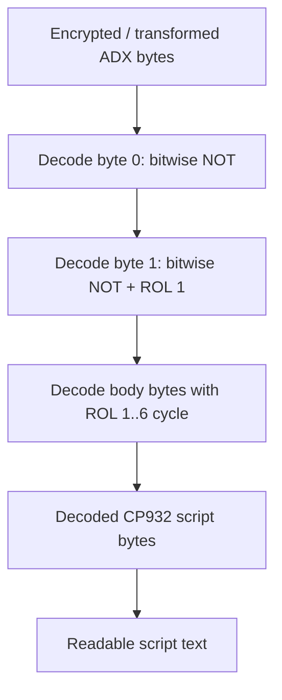
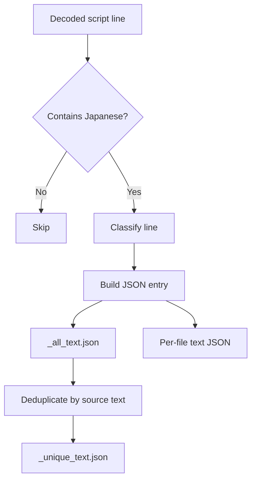
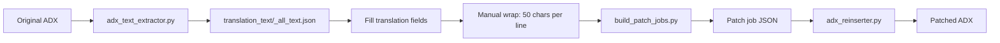

# Megami ADX Text Extraction Summary

This document summarizes the text extraction work step by step, including what was attempted, what failed, what was discovered, and what became the final extraction path.

## 1. Identified The Translation Target Files

The project contains many asset files, but `.adx` files were identified as the important script/event files for translation.

Known file roles:

- `.bmx`: graphics or image assets.
- `.wav`: audio assets.
- `.dxg`: likely compressed/packed graphics or effects.
- `.adx`: game scripts, events, maps, and scenario text.
- `main.exe`: game executable containing the loader/interpreter logic.

Why this mattered:

- It narrowed the translation target from the whole folder to script-bearing `.adx` files.
- It made `main.exe` the key reverse-engineering source for decoding and script behavior.

## 2. Tried Naive Shift-JIS Extraction

Initial tools scanned raw `.adx` bytes for valid Shift-JIS-looking sequences.

Files from this phase included tools such as:

- `adx_tool.py`
- `improved_extract.py`
- `extract_v4.py`
- earlier debug scripts and JSON outputs under `extracted_v2/` and `extracted_v4/`

Why it was tried:

- The game is Japanese and likely uses Shift-JIS/CP932.
- Many older Windows visual novels store text directly in Shift-JIS.

Why it failed:

- Raw `.adx` files were not plain CP932 text.
- Script opcode bytes often formed byte pairs that looked like valid Shift-JIS.
- The output contained false positives, broken fragments, and huge merged garbage strings.

Main failure mode:

```text
raw bytes -> valid-looking Shift-JIS pair -> false Japanese candidate
```

This meant raw byte scanning could not be trusted as the final extraction method.

## 3. Analyzed The Executable For Script Clues

`main.exe` was inspected to understand how the game loads and interprets `.adx` files.

Important findings:

- A script command table was found around executable offset `0x072700 - 0x072BF4`.
- The interpreter loop appears after the command table.
- Commands include entries such as `@go`, `@if`, `@call`, `@ret`, `@h`, `@maptitl`, `@rpgrun`, and others.

Why this mattered:

- It confirmed that decoded scripts are line/command-oriented.
- It showed that `@` commands are meaningful script commands.
- It explained why text and control data were mixed.

## 4. Built VM-Aware Analysis Tools

Created and used `adx_vm_analyzer.py`.

Purpose:

- Stop treating every Shift-JIS-looking byte sequence as real text.
- Inspect repeated opcode patterns.
- Compare candidate fragments against nearby byte structure.
- Probe possible transforms.

Generated reports under `vm_analysis/`:

- `vm_analysis/boundaries/`
- `vm_analysis/pattern_report.md`
- `vm_analysis/candidate_classification.md`
- `vm_analysis/transform_probe.md`

Why this helped:

- It demonstrated that many small-script candidates were false positives.
- It confirmed that the problem was not just poor text grouping.
- It pushed the investigation toward a file-level decode/transform.

Key result:

- Most apparent Shift-JIS text in files such as `tani.adx` and `dandan.adx` was likely opcode/operand noise before decoding.

## 5. Discovered The Real ADX Decode Routine

The breakthrough was finding the actual ADX decode routine in `main.exe`.

Location:

```text
main.exe VA: 0x46E820
```

The routine decodes the whole ADX file before the script is interpreted.

Decode algorithm:

1. Decode byte `0` with bitwise NOT.
2. Use decoded byte `0` as the first rotation span.
3. Decode byte `1` with bitwise NOT.
4. Rotate decoded byte `1` left once.
5. Use decoded byte `1` as the alternate rotation span.
6. For bytes from offset `2` onward:
   - rotate each byte left by a cycling count from `1` to `6`;
   - decrement the span counter;
   - when the span counter reaches zero, reset span and rotation.

Why this mattered:

- It converted the problem from heuristic extraction to deterministic decoding.
- Decoded `.adx` files became readable CP932 scripts.



## 6. Implemented The Final Decoder And Extractor

Created `adx_text_extractor.py`.

Core functions:

- `rol8`
- `decode_adx_bytes`
- `decode_adx_text`
- `contains_japanese`
- `classify_line`
- `extract_lines`

What it does:

- Reads `.adx` files.
- Decodes each file with the discovered algorithm.
- Decodes the result as CP932.
- Splits decoded scripts into lines.
- Classifies lines as command, label/comment, or text.
- Extracts Japanese-bearing lines for translation.

Line classification:

| Kind | Example | Meaning |
| --- | --- | --- |
| `text` | `シュリが俺を見つめている。` | Dialogue or narration. |
| `command` | `@maptitl 野牛の蹄亭` | Script command with Japanese argument. |
| `comment_or_label` | `*+広場` | Label/comment-like script marker. |

Why this structure was chosen:

- Translators need text plus file/line context.
- Patching later needs exact file and line references.
- Commands and labels may contain Japanese that also needs translation, but they are riskier than normal text.

## 7. Generated Decoded Scripts

Output directory:

```text
decoded_adx/
```

This contains decoded UTF-8 inspection files for all `.adx` scripts.

Example:

```text
decoded_adx/s1.txt
```

The decoded `s1.adx` script begins with readable lines such as:

```text
*+一日目ミルフェの街
@maptitl 野牛の蹄亭
```

Why this mattered:

- It gave a human-readable view of the scripts.
- It made manual validation possible.
- It provided context around extracted lines.

Important note:

- `decoded_adx/*.txt` files are inspection artifacts.
- Later reinsertion should patch decoded bytes directly from original `.adx`, not rely on editing these text files.

## 8. Generated Translation Worklists

Output directory:

```text
translation_text/
```

Important files:

| File | Purpose |
| --- | --- |
| `_all_text.json` | Full extracted corpus with every Japanese-bearing line. |
| `_all_text.txt` | Plain text worksheet version of the full corpus. |
| `_unique_text.json` | Deduplicated source strings with references. |
| `_unique_text.txt` | Plain text worksheet version of unique strings. |
| `_summary.json` | Per-file extraction counts. |
| `s1_text.json` | Extracted lines from `s1.adx`. |
| `hiroba_text.json` | Extracted lines from `hiroba.adx`. |

Each JSON entry includes:

```json
{
  "id": "s1:00075",
  "file": "s1.adx",
  "line_number": 75,
  "kind": "text",
  "command": "",
  "source_line": "シュリが俺を見つめている。",
  "text": "シュリが俺を見つめている。",
  "translation": ""
}
```

Why this format matters:

- `id` gives a stable translation entry key.
- `file` and `line_number` allow exact reinsertion.
- `source_line` allows source validation during patching.
- `translation` is the field that translators or automation fill in.



## 9. Extraction Results

Final extraction counts:

- Decoded `.adx` files: `138`
- Japanese-bearing line entries: `28,815`
- Unique Japanese strings: `15,826`

High-value extracted files:

| File | Why Important |
| --- | --- |
| `s1.adx` | Beginning scenario text. |
| `hiroba.adx` | Large map/event script with many lines. |
| `sysstar.adx` | Large system/star/event text file. |
| `map*.adx` | Map-specific event/dialogue scripts. |
| `tbat.adx` | Battle-related text. |
| `tchr.adx` | Character-related text. |

## 10. Validated The Extraction Against In-Game Text

The screenshot line:

```text
シュリが俺を見つめている。
```

was found at:

```text
s1.adx line 75
```

This confirmed that:

- the decoded scripts align with in-game displayed text;
- file and line references are useful for reinsertion;
- the extraction is not just readable but operationally patchable.

Another screenshot block:

```text
レヴィアは付き合いの長い者にしか判らぬ、
僅かに気落ちした表情をしたかと思うと、
次の瞬間には踵を返し颯爽と去って行った。
```

was found at:

```text
s1.adx lines 424-426
```

This block was later used for text-box length tests.

## 11. Current Extraction-To-Translation Workflow

Recommended workflow:

1. Use `translation_text/_all_text.json` for full context-preserving translation.
2. Fill the `translation` fields for entries that are ready.
3. Use `build_patch_jobs.py` to convert translated entries into patch jobs.
4. Use `adx_reinserter.py` to patch translated lines back into clean original `.adx` files.

Confirmed textbox constraints:

- The game does not auto-wrap inserted English.
- Use a maximum of `50` visible ASCII characters per rendered line.
- A visible character name consumes one line.
- Character dialogue pages can show the name plus `3` text lines, for `4` displayed lines total.
- Longer translations must be manually wrapped or split into additional message blocks.



## 12. Important Encoding Notes

The game scripts are CP932 after ADX decoding.

Translation constraints:

- ASCII English encodes safely in CP932.
- Some Unicode punctuation may not encode in CP932.
- The reinserter should use strict CP932 encoding to catch unsupported characters.

PowerShell display issue:

- Japanese may appear as mojibake in PowerShell output depending on console encoding.
- The extracted files are valid UTF-8.
- Python reads with `encoding="utf-8"` confirm correct Japanese.

## 13. Key Files Created Or Used

| File / Directory | Purpose |
| --- | --- |
| `adx_text_extractor.py` | Final ADX decoder and text extractor. |
| `decoded_adx/` | Human-readable decoded script files. |
| `translation_text/` | Translation worklists and extracted corpus. |
| `translation_text/_all_text.json` | Main context-preserving translation corpus. |
| `translation_text/_unique_text.json` | Deduplicated translation worklist. |
| `translation_text/_summary.json` | Extraction count summary. |
| `adx_vm_analyzer.py` | Earlier VM/pattern analysis tool used before the decode routine was found. |
| `vm_analysis/` | Reports from the VM-aware analysis phase. |
| `main_exe_analysis.md` | Notes from executable/script command analysis. |
| `chat_summary.md` | Running project summary and handoff notes. |

## 14. Final Extraction Status

Extraction is complete enough for translation and reinsertion work.

Current state:

- The `.adx` decode is understood.
- All `.adx` files were decoded.
- Translation worklists were generated.
- In-game text was matched back to extracted file/line entries.
- Reinsertion has already been proven with a line from the extracted corpus.
